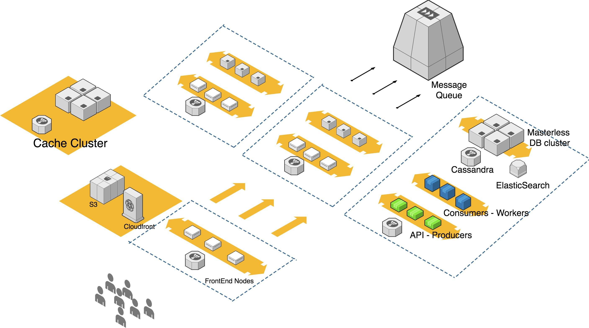

# Meet Me There
Meet Me There is an example social application.


### Setup
```
cp .env.docker-compose .env
docker-compose exec php-fpm php artisan migrate
docker-compose exec php-fpm php artisan db:seed
```


Example architecture for high scale use: 




In this example application a similar lower scale architecture has been chosen.
- We have domains (user, group, email etc) which play the role of our microservices
- We have messages/events with which our microservices communicate

However several steps will be needed to go from this small-scale to big-scale
1. Split domains to actual separate services
2. Use a messaging mechanism instead of events
3. Create separate model interpretations for each domain/service

## Things I have implemented differently  

#### Architecture
- Use Message Queue ( not just queable event listeners)
    - It would make the transition to actual micri service per domain easier
- Maybe use a Graph Database. The relations between the models are the main interest.

#### Code
- Make api tokens expirable
- Make FriendRequest return class instead of array for `FriendRequestRepository::findFriendRequestsForUser` and `FriendRequestRepository::findFriendInvitesForUser`
- Make paginated results for queries

## Tests

##### Which parts I would cover, which not and why ?
- To get the most out of our tests i would focus on the code that has our core business logic. In this example application our core logic exists in the EventHandlers.
- Also tests should be made for the controllers as they have the logic for constructing the event to be emitted. To do this in an efficient way though we would need to try abstract the framework out of our controllers.

I would refrain from testing dump classes and framework code.

#### Verify and prove that such coverage is achieved
- Code coverage tools can help in this 


